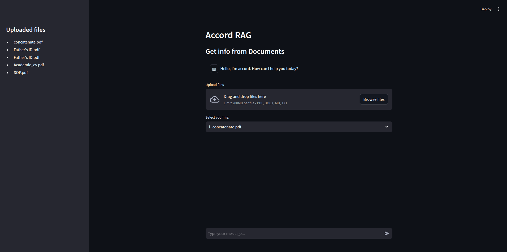

# RAG-DeepSeek-r1

**rag-deepseek-r1** is an advanced chatbot project designed to enable natural language interaction with unstructured datasets (e.g., docx, txt, md, pdf) through **Question & Answering (Q&A)** and **Retrieval-Augmented Generation (RAG)**. The project integrates cutting-edge technologies, including **deepseek-r1** and **Langchain**, to provide a seamless and intelligent conversational experience.

## UI:


## Key Features
- **LLM-Powered Data Processing**: Before Embedding we find the  actual meaning of the chunk based on nearest or full docmunet then embedded the documents.
- **Multi-Format Support**: Works with various document formats, including docx, txt, md, and pdf.
- **Reranker**: Ranking the chunks best on query.

## Technologies Used
- **Deepseek-r1**: Core engine for natural language processing and understanding.
`deepseek-r1:8b`/`deepseek-r1:1.5b`
- **Langchain**: Facilitates intelligent data retrieval and reasoning.
- **LLMs (Large Language Models)**: Powers the extraction and organization of information from unstructured data.
-  **Embedding Model**: `BAAI/bge-small-en-v1.5`

## Use Cases
- **Document Q&A**: Ask questions and get precise answers from unstructured documents.
- **RAG (Retrieval-Augmented Generation)**: Retrieve relevant information and generate context-aware responses.

## Getting Started
To get started with **rag-deepseek-r1**, follow the instructions in the [Installation Guide](#installation) 

**Key Note:** Before running the RAG chatbot, you should first install [Ollama](https://ollama.com/download) and the [Deepseek model on Ollama](https://ollama.com/library/deepseek-r1).
```
ollama run deepseek-r1:1.5b
ollama run deepseek-r1:7b
ollama run deepseek-r1:8b
```

## Installation
1. Clone the repository:
   ```bash
   git clone https://github.com/your-username/rag-deepseek-r1.git
   ```
2. Run the chatbot:
   ```bash
   streamlit run app.py
   ```

## License
This project is licensed under the MIT License. See the [LICENSE](LICENSE) file for details.

